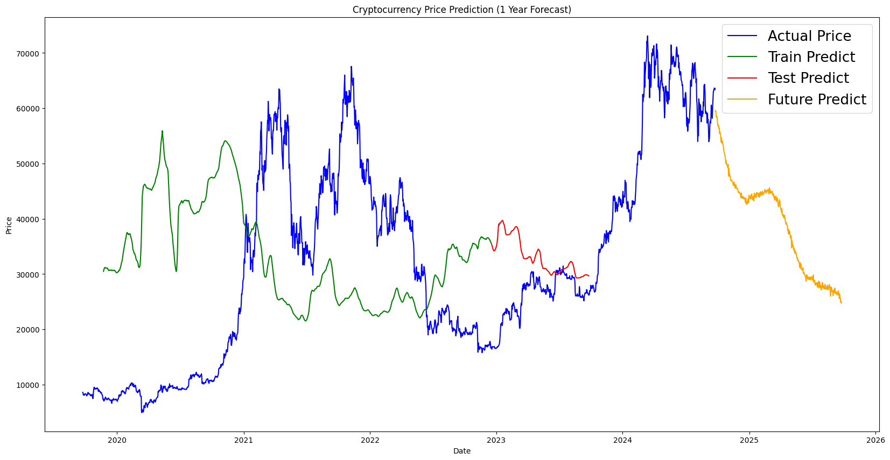

# Cryptocurrency Price Prediction using Bi-LSTM

This project aims to predict the future prices of cryptocurrencies using a **Bidirectional Long Short-Term Memory (Bi-LSTM)** model. The program will take a CSV file as input, which must contain two columns: `Date` and `Close`. It will then predict the closing price for the next year, visualize the prediction with a graph, and evaluate the model's performance using metrics like **Mean Squared Error (MSE)**, **Root Mean Squared Error (RMSE)**, and **Mean Absolute Percentage Error (MAPE)**.

## Table of Contents

- [Installation](#installation)
- [Usage](#usage)
- [Input File Format](#input-file-format)
- [Output](#output)
- [Evaluation Metrics](#evaluation-metrics)
- [Contributing](#contributing)

## Installation

1. Clone the repository:
    ```bash
    git clone https://github.com/your-username/cryptocurrency-price-prediction.git
    cd cryptocurrency-price-prediction
    ```

2. Install the required dependencies:
    ```bash
    pip install -r requirements.txt
    ```

3. Ensure you have **TensorFlow** and **Keras** installed for running the Bi-LSTM model:
    ```bash
    pip install tensorflow keras
    ```

## Usage

1. Run the program and provide a CSV file as input:
    ```bash
    python predict.py --input_file path/to/your/inputfile.csv
    ```

2. The program will:
   - Preprocess the data.
   - Train a Bi-LSTM model.
   - Predict the next one year of cryptocurrency prices.
   - Plot a graph showing actual vs. predicted values.
   - Print performance metrics such as **MSE**, **RMSE**, and **MAPE**.

## Input File Format

The input CSV file should contain at least two columns:
1. `Date`: The date of the cryptocurrency price (in `YYYY-MM-DD` format).
2. `Close`: The closing price of the cryptocurrency for that date.

**Example:**

| Date       | Close   |
|------------|---------|
| 2023-01-01 | 17000.5 |
| 2023-01-02 | 17250.3 |
| 2023-01-03 | 16890.8 |

Make sure the dates are in sequential order without missing any values, as this is required for the time-series prediction.

## Output

1. **Graph of Predictions**:  
   A graph will be generated showing the actual closing prices and predicted prices for the next year.

   **Sample Output**:

   

2. **Performance Metrics**:  
   The program will output the following metrics:
   - **MSE (Mean Squared Error)**: The average squared difference between the actual and predicted values.
   - **RMSE (Root Mean Squared Error)**: The square root of the average squared differences between the actual and predicted values.
   - **MAPE (Mean Absolute Percentage Error)**: The average of the absolute percentage errors between the actual and predicted values.

   Example:
   ```bash
   MSE: 23456.78
   RMSE: 153.21
   MAPE: 2.45%
   ```

## Evaluation Metrics

- **MSE (Mean Squared Error)**: Measures the average squared difference between actual and predicted values.
  
  Formula:
  MSE = (1/n) * Σ(actual - predicted)^2


- **RMSE (Root Mean Squared Error)**: The square root of MSE, providing error in the same units as the original data.

  Formula:
  RMSE = √MSE


- **MAPE (Mean Absolute Percentage Error)**: Measures the accuracy of predictions as a percentage.

  Formula:
 MAPE = (1/n) * Σ(|(actual - predicted) / actual|) * 100


## Contributing

Contributions are welcome! Feel free to open issues or submit pull requests. When contributing, please ensure your code follows the project's coding style and includes relevant tests.

